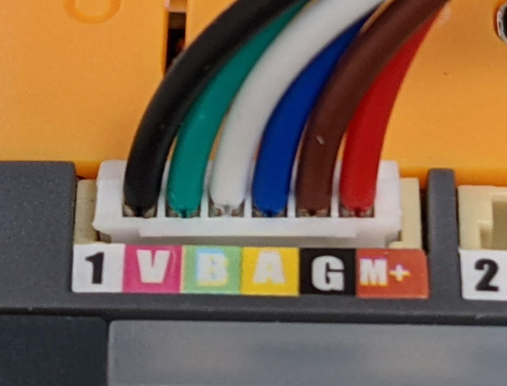

# M5Stack Core2 with DC Motor Module

An attempt to use [GBMQ-GM12BY20](https://www.amazon.com/GBMQ-GM12BY20-Micro-Reduction-Magnetic-Encoder/dp/B07J5MRHKH) on [M5Stack Core2](https://m5stack.com/collections/m5-core/products/m5stack-core2-esp32-iot-development-kit) with [DC Motor Module](https://m5stack.com/products/lego-module).

## GBMQ-GM12BY20 connector PIN re-rearrangement

The connector pin should be rearranged to match to the following picture:

## Changes to the original code

From the original [LEGO_PLUS.ino](https://github.com/m5stack/M5Stack/blob/master/examples/Modules/LEGO_PLUS/LEGO_PLUS.ino), I modified the following things:

- Replace `M5Stack.h` with `M5Core2.h`
- Copy `writeBytes`/`readBytes` methods from `utility/CommUtil.h` and replace every `Wire` with `Wire1`.
    - Core2 uses `Wire` on GPIO32,33 combination whereas Core uses `Wire` on GPIO21,22
    - On Core2, `Touch.begin` initializes `Wire1` on GPIO21,22
- Remove `M5.Power.begin()` from `setup` function

Caveat: With these changes, the code seems working correctly but the encoder direction seems opposite to the motor direction. Should we swap motor PINs or just flip the encoder value's sign.

## Demo Video

<blockquote class="twitter-tweet">
Amazonで買った安いエンコーダ付きモーターをレゴEV3モーターの代わりにMStack5 Core2に接続して使う。理屈は簡単でもI2Cのピンが変わると割と面倒だった。<a href="https://t.co/AGvIFxEt8g">https://t.co/AGvIFxEt8g</a> <a href="https://t.co/350EzfS4nG">pic.twitter.com/350EzfS4nG</a>
&mdash; Takashi Kawasaki (@espresso3389) <a href="https://twitter.com/espresso3389/status/1342703981588451333?ref_src=twsrc%5Etfw">December 26, 2020</a></blockquote> 

# Appendix

## GBMQ-GM12BY20 original connector PIN layout

The PIN assignment for [GBMQ-GM12BY20 DC 6V 2W Micro Speed Reduction Motor Mini Gear Box Motor with Magnetic Coded Disc Hall Encoder (30RPM)](https://www.amazon.com/GBMQ-GM12BY20-Micro-Reduction-Magnetic-Encoder/dp/B07J5MRHKH), according to the documentation on Amazon page:

Code  | Description
------|---------------
Black |Motor -
Red   |Motor +
Brown |Encoder +
Green |Encoder -
Blue  |Encoder A
White |Encoder B

## DC Motor Module PIN layput

And according to several sources, DC Motor Module's PIN layout is:

PIN | Cable | RJ12 | Description
----|----|---|-------------
M+  | Black | 2 | motor +
G   | Green | 4 | encoder Vcc (3.3V - 5V)
A   | Yellow | 5 | encoder A
B   | Blue | 6 | encoder B
V   | Red | 3 | encoder GND
1   | White | 1 | motor -

### References

- [Re: Cheaper alternative to brickpi?](https://www.raspberrypi.org/forums/viewtopic.php?t=239548#p1463935)
- [Using LEGO MINDSTORMS Motors with BeagleBone Blue](https://lechnology.com/2017/03/using-lego-mindstorms-motors-with-beaglebone-blue/)

